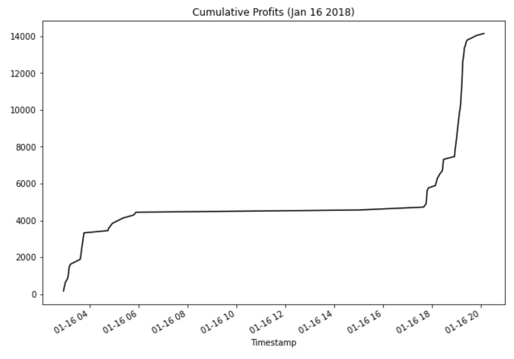

# Module Challenge 3


---

## Technologies


The Application has specific technologies that will be needed to run properly.


**Languages Required:** *Python*

**Libraries Required:** *Pandas, Patlib, CSV, MatplotLib, Numpy, & Datetime*

Before running the application the following Libraries will need to be imported:

```python
import csv
import pandas as pd
from pathlib import Path
%matplotlib inline
from datetime import datetime as dt
import numpy as np
```


Further details denoting requirements and verions are available in the requirements file.

[Requirements](./Starter_Code-2/requirements.txt)


---

## Installation Guide

This app will not work without the proper technologies listed above.  To ensure you have the applicable tools please install the requirements for the Loan Qualifying Application using the text file in the loan_qualifier_app folder as follows:

In The Terminal Run:

```python

pip install -r requirements.txt 

```


---

## Usage


### **For Coding Purposes:** 


1. The application intially imports different modules that will be useful.
2. Collect the data using read_csv and run minor analytics to understand the datasets.
3. Prepare the data with the proper data types to be used for analytics.
4. Analyze the data by choosing segments of data, running summaries, and creating charts (Box Plot and Plot).
5. Calculate Arbitrage Profits using statistical funcitons to understand the profit possibilities.


### **For Users:** Use the Crypto Arbitrage Application to understand Historical data from Bitstamp and Coinbase:

The application includes the following charts

**Charts**

1. Bitstamp Prices Jan 13 - 27
2. Coinbase Prices Jan 13 - 27
3. Bitstamp & Coinbase Prices (Jan 13 - 27)
4. Early Bitstamp & Coinbase Prices (Jan 10th - Feb 10th)
5. Late Bitstamp & Coinbase Prices (Feb 26th - Mar 26th)
6. Late Bitstamp & Coinbase Prices (Jan 4th 2018)
7. Arbitrage Early Spread
8. Midle Bitstamp & Coinbase Prices (Jan 21st 2018)
9. Arbitrage Middle Spread
10. Late Bitstamp & Coinbase Prices (Jan 26th 2018)
11. Arbitrage Late Spread
12. Profit Per Trade (Jan 16th 2018)
13. Cumulative Profits (Jan 16th 2018)*


**A display of the Final Chart (Cumulative Profits from Jan 16th 2018) is listed below**




---

## Contributors

Tracy Davis <TracyMDavis88@gmail.com>

[Tracy Davis LinkedIn](https://www.linkedin.com/in/tracy-davis-mba-ma-2940a232/)

---

## License

MIT License

Copyright (c) [2022] [Tracy Davis]


